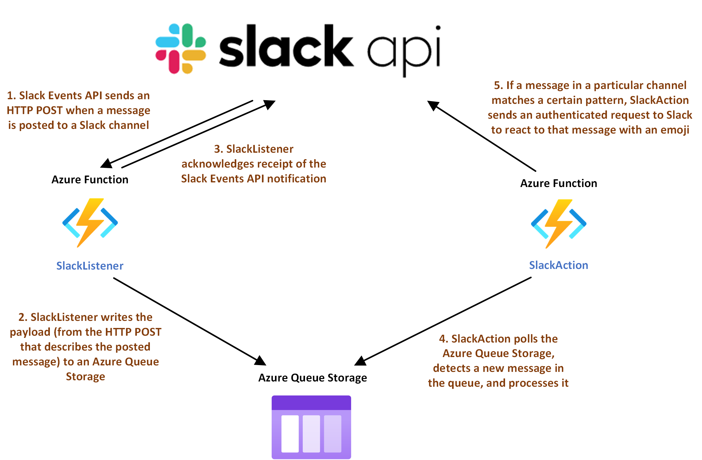

# Blue Line Bot

This app leverages the [Slack Events API](https://api.slack.com/apis/connections/events-api) and the [Python Slack SDK](https://slack.dev/python-slack-sdk/) to create a [Slack app](https://api.slack.com/authentication/basics) that reacts with a train emoji to any message posted in a specific Slack channel that references the Chicago O'Hare airport. 

## Architecture

## Motivation

To not-so-subtly remind Slack users of the reliability and low cost of the CTA Blue Line trains compared to other transportation options to get to and from the Chicago O'Hare airport.

In addition, creating a simple app leveraging cheap cloud services to interact with Slack automatically. This code:
- Uses the Slack Events API to implement a push model. That is, the Slack API service sends Blue Line Bot a notification when a message is posted. While messages are not being posted, the frontend service of the Blue Line Bot app is idle, and is not constantly querying Slack for new information.
- In addition to cloud-specific libraries for hosting, this app simply uses the Python Slack SDK. It does not use any other external libraries or frameworks such as [Flask](https://medium.com/developer-student-clubs-tiet/how-to-build-your-first-slack-bot-in-2020-with-python-flask-using-the-slack-events-api-4b20ae7b4f86) or [Bolt](https://api.slack.com/tutorials/tracks/hello-world-bolt), which makes understanding what is going on under the hood a bit easier.

## Hosting

Compute and storage resources to support this application are hosted in Microsoft Azure, leveraging:
- [Azure Functions](https://docs.microsoft.com/en-us/azure/azure-functions/), a serverless computing cloud service that executes code on demand when an appropriate trigger occurs.
- [Azure Queue Storage](https://docs.microsoft.com/en-us/azure/storage/queues/storage-queues-introduction), a cloud service for storing messages in a queue.

## License

MIT